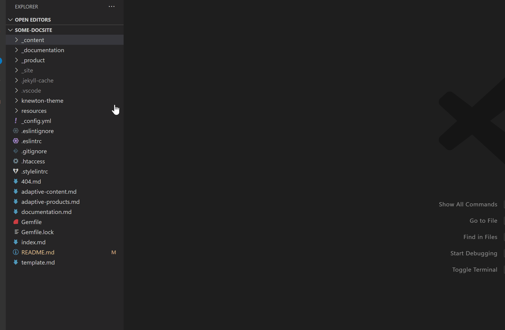
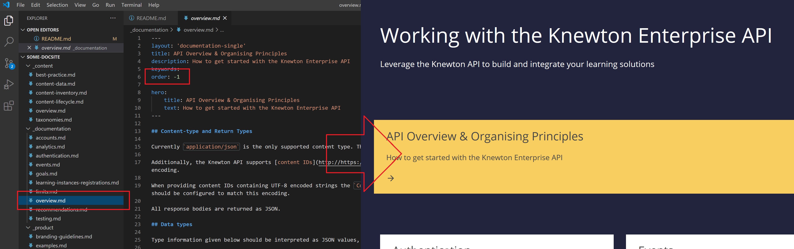
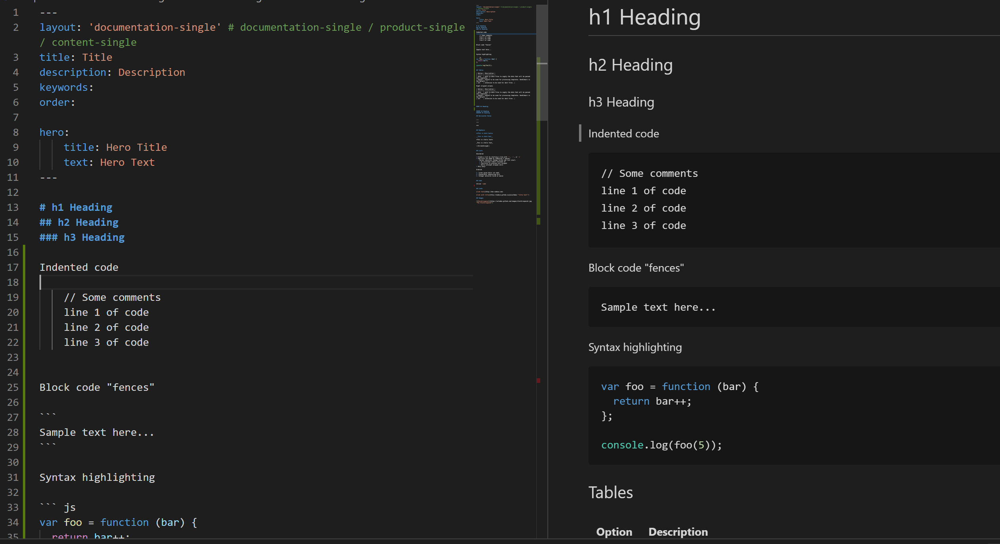
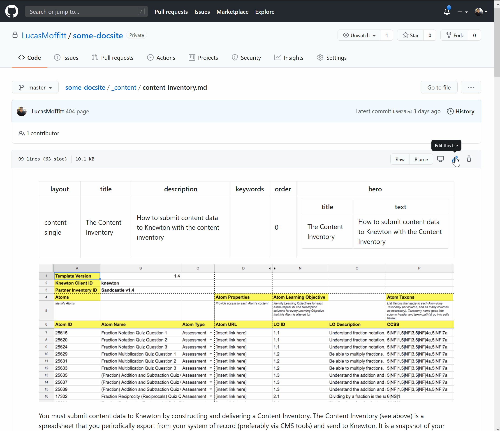
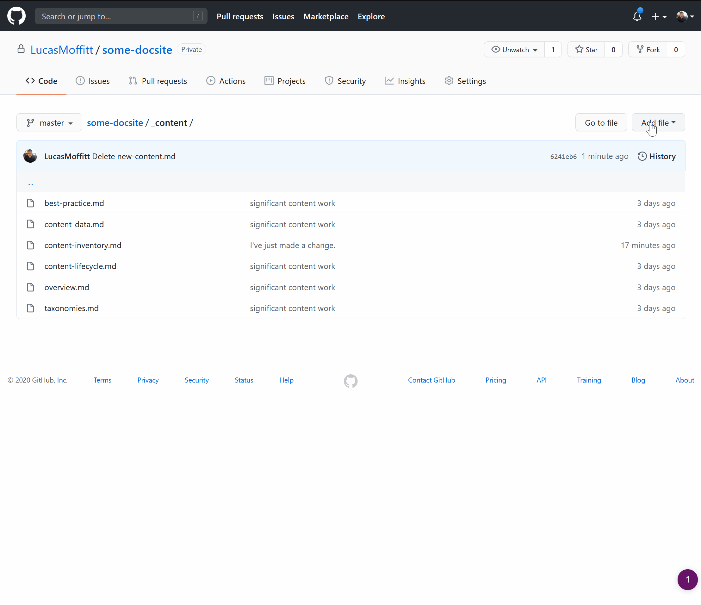

<br />

<p align="center">
  <a href="/">
    
  </a>

  <h1 style="border-bottom:none" align="center">dev.knewton.com</h3>

  <p align="center">
    repository containing the dev.knewton.com jekyll theme for github pages and enterprise api, product and content documentation.
    <br />
    <br />
    <a href="https://dev.knewton.com"><strong>Explore »</strong></a>
    <br />
    <br />
  </p>
</p>

---
<br>

## Table of Contents

- [Deploying and Editing locally](#deploying-and-editing-locally)
  - [Prerequisites](#prerequisites)
  - [_config.yml](#_configyml)
  - [Configuring Github / Github Pages](#configuring-github--github-pages)
- [Project Structure](#project-structure)
  - [Page Structure](#page-structure)
  - [Layout Alternatives](#layout-alternatives)
  - [Promoting a page](#promoting-a-page)
  - [The Template Page](#the-template-page)
- [Editing Content](#editing-content)
  - [Relative Urls for Images and Links](#relative-urls-for-images-and-links)
    - [Relative URL for an Image](#relative-url-for-an-image)
    - [Relative URL for a Link](#relative-url-for-a-link)
  - [Adding images for pages](#adding-images-for-pages)
  - [Editing existing content](#editing-existing-content)
  - [Adding new content](#adding-new-content)

<br>

---

<br>

# Deploying and Editing locally

In your clone or fork, ensure the github repository is configured for github pages, and that it's configured to build from the master branch.

## Prerequisites

* ruby
* jekyll

```sh
bundle exec jekyll serve
```

## _config.yml
`_config.yml` contains all of the basic properties for managing an instance of the site, including complete nav / footer link customisations.

**NOTE:** If you make any changes to the properties or values in `_config.yml` you must restart the terminal.

Ensure you edit the following base url and google analytics values:

```
knewton:
    baseurl: /some-sub-domain
    google_analytics:
        tracking_code: x
```

## Configuring Github / Github Pages
In github, you must configure the repository as a github pages project. You also need to ensure you select either the Master branch, or your desired branch before the page will build.


In this same section you can configure your custom domain name after github pages has been enabled and correctly configured.

**Note:** The repository must be public

<br>

---

<br>

# Project Structure
The project is broken down into three key content structures (jekyll collections).

`Content`, `Documentation` and `Product` are both folders and application collections that will update when new files are added following the page template requirements



## Page Structure
Each page within these three collections must adhere to the template page structure defined below, updated with the detailed relevant to your new page.

```
---
layout: 'documentation-single'
title: Learner Analytics
description: 
keywords: 
order: 0

hero:
    title: Analytics
    text: Learner Analytics
---

Your markdown / page content lives here
```

**NOTE:** See the preview template page at /template for a full example

The page title and descriptions are included in not just the HTML title / description META, but also in the page preview text on the content index pages. 

## Layout Alternatives
Each page must specify which template should be applied in the header `layout` variable, these layout variables are limited to:

* `documentation-single`
* `product-single`
* `content-single`

## Promoting a page
A page within a collection can be promoted to the primary CTA for the collection by specifying an order of `-1`. Only one page *should* be promoted at one time per collection.



## The Template Page
In the root directory exists a markdown file called `template.md`. This page takes advantage of the `documentation-single` layout to provide a basic demo / template page to make starting new documentation pages easier. This template also includes markdown basics like titles, images, tables, code, lines etc

You can view the compiled template page by navigating to `/template` 



<br>

---

<br>

# Editing Content
All content is editable following the markdown syntax (https://www.markdownguide.org/getting-started/)

## Relative Urls for Images and Links
Because of the project structure, the entire thing can be hosted off multiple repositories / folders / subdomains. In `_config.yml` you set the base url variable per instance of the site, e.g: `knewton: baseurl: /some-docsite/`

To ensure links are always relative to the location, you must specify the relative_url filter when building the links. for example

### Relative URL for an Image

``

Note the `relative_url` syntax

### Relative URL for a Link

`[Goal Targets]({{ '/documentation/goals' | relative_url }})`

Note the `relative_url` syntax

## Adding images for pages
Images that relate to the content are contained in `/resources/images` please ensure you appropriately name your image files. e.g: `content-inventory-1.png` or `documentation-workflow-1.png`

## Editing existing content
You can quickly edit existing content by using the github ui and committing changes back. These changes will be automatically collected by github and the content re-generated in almost real time.



## Adding new content

You can navigate to the colleciton you want to add a new page to and add the content directly into github.


