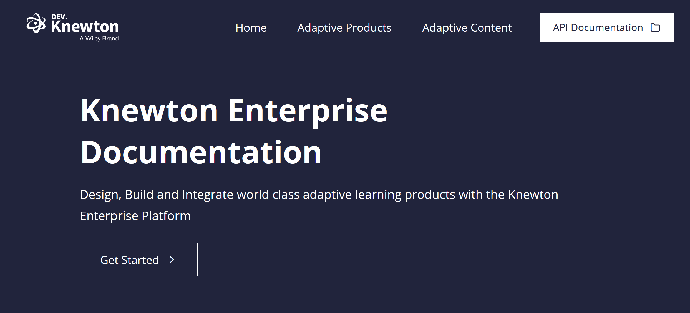

<!-- PROJECT LOGO -->
<br />
<p align="center">
  <a href="/">
    
  </a>

  <h1 style="border-bottom:none" align="center">dev.knewton.com</h3>

  <p align="center">
    repository containing the dev.knewton.com jekyll theme for github pages and enterprise api, product and content documentation.
    <br />
    <br />
    <a href="https://dev.knewton.com"><strong>Explore »</strong></a>
    <br />
    <br />
  </p>
</p>

---



# Deploying / Editing locally

Clone the repository, ensure the github repository is configured for github pages and that it's building from the master branch

## Prerequisites for local deployment

* jekyll

```sh
bundle exec jekyll serve
```

# Content Structure
The project is broken down into three key content structures, allowing product, tech and content to own and manage their own sections of the website.

Content, Documentation and Content are both folders and application collections that will update when new files are added following the page template requirements


## Page Structure
Each page within these three collections must adhere to the template page structure defined below, updated with the detailed relevant to your new page.

```
---
layout: 'documentation-single'
title: Learner Analytics
description: 
keywords: 
order: 0

hero:
    title: Analytics
    text: Learner Analytics
---
```

The page title and descriptions are included in not just the HTML title / description metas, but also in the page preview text on the content index pages. 

## Layout Alternatives
Each page must specify which template should be applied, these layout variables are limited to:

* `documentation-single`
* `product-single`
* `content-single`

## Promoting a page
A page within a colleciton can be promoted to the primary CTA for the collection.


# h1 Heading
## h2 Heading
### h3 Heading
#### h4 Heading
##### h5 Heading
###### h6 Heading

## Horizontal Rules

___

---

***


## Emphasis

**This is bold text**

__This is bold text__

*This is italic text*

_This is italic text_

~~Strikethrough~~


## Lists

Unordered

+ Create a list by starting a line with `+`, `-`, or `*`
+ Sub-lists are made by indenting 2 spaces:
  - Marker character change forces new list start:
    * Ac tristique libero volutpat at
    + Facilisis in pretium nisl aliquet
    - Nulla volutpat aliquam velit
+ Very easy!

Ordered

1. Lorem ipsum dolor sit amet
2. Consectetur adipiscing elit
3. Integer molestie lorem at massa


## Code

Inline `code`

Indented code

    // Some comments
    line 1 of code
    line 2 of code
    line 3 of code


Block code "fences"

```
Sample text here...
```

Syntax highlighting

``` js
var foo = function (bar) {
  return bar++;
};

console.log(foo(5));
```

## Tables

| Option | Description |
| ------ | ----------- |
| data   | path to data files to supply the data that will be passed into templates. |
| engine | engine to be used for processing templates. Handlebars is the default. |
| ext    | extension to be used for dest files. |

Right aligned columns

| Option | Description |
| ------:| -----------:|
| data   | path to data files to supply the data that will be passed into templates. |
| engine | engine to be used for processing templates. Handlebars is the default. |
| ext    | extension to be used for dest files. |


## Links

[link text](http://dev.nodeca.com)

[link with title](http://nodeca.github.io/pica/demo/ "title text!")

## Images


